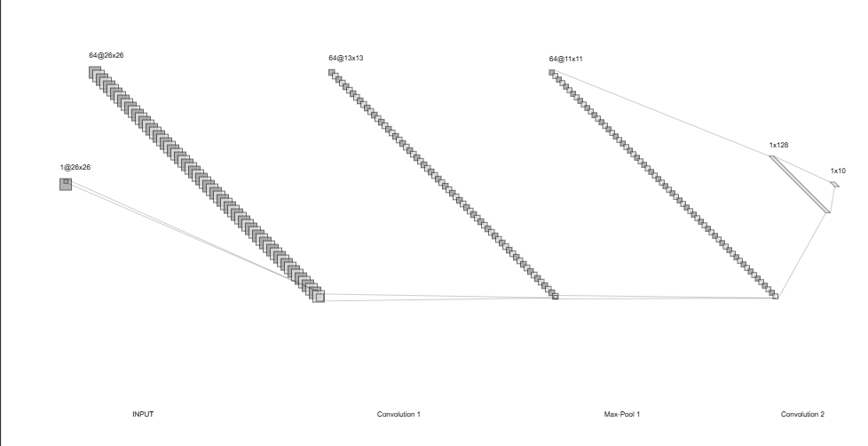
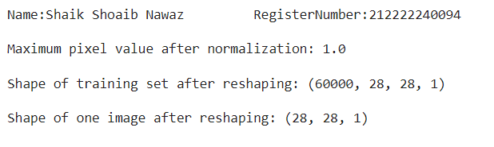
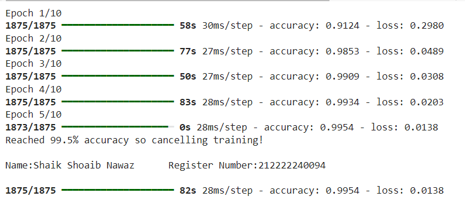

# Implementation-of-CNN

## AIM

To Develop a convolutional deep neural network for digit classification.

## Problem Statement and Dataset:
The goal of this project is to develop a Convolutional Neural Network (CNN) to classify handwritten digits using the MNIST dataset. Handwritten digit classification is a fundamental task in image processing and machine learning, with various applications such as postal code recognition, bank check processing, and optical character recognition systems.

The MNIST dataset consists of 28x28 grayscale images of handwritten digits (0-9), totaling 60,000 training images and 10,000 test images. The challenge is to train a deep learning model that accurately classifies the images into the corresponding digits.

## Neural Network Model



## DESIGN STEPS

### STEP 1:
Import the necessary libraries and Load the data set.

### STEP 2:
Reshape and normalize the data.

### STEP 3:
In the EarlyStoppingCallback change define the on_epoch_end funtion and define the necessary condition for accuracy

### STEP 4:
Train the model


## PROGRAM

### Name: Shaik Shoaib Nawaz
### Register Number: 212222240094
```
import numpy as np
import tensorflow as tf
# Provide path to get the full path
data_path ='/content/mnist.npz.zip'

# Load data (discard test set)
(training_images, training_labels), _ = tf.keras.datasets.mnist.load_data(path=data_path)

print(f"training_images is of type {type(training_images)}.\ntraining_labels is of type {type(training_labels)}\n")

# Inspect shape of the data
data_shape = training_images.shape

print(f"There are {data_shape[0]} examples with shape ({data_shape[1]}, {data_shape[2]})")
# reshape_and_normalize

def reshape_and_normalize(images):
    """Reshapes the array of images and normalizes pixel values.

    Args:
        images (numpy.ndarray): The images encoded as numpy arrays

    Returns:
        numpy.ndarray: The reshaped and normalized images.
    """

    ### START CODE HERE ###

    # Reshape the images to add an extra dimension (at the right-most side of the array)
    images =  images.reshape(images.shape[0], images.shape[1], images.shape[2], 1)
    # Normalize pixel values
    images = images / np.max(images)
    ### END CODE HERE ###

    return images
    # Reload the images in case you run this cell multiple times
    (training_images, _), _ = tf.keras.datasets.mnist.load_data(path=data_path)

    # Apply your function
    training_images = reshape_and_normalize(training_images)
    print('Name:Shaik Shoaib Nawaz         RegisterNumber:212222240094          \n')
    print(f"Maximum pixel value after normalization: {np.max(training_images)}\n")
    print(f"Shape of training set after reshaping: {training_images.shape}\n")
    print(f"Shape of one image after reshaping: {training_images[0].shape}")
    from tensorflow.keras.callbacks import Callback
class EarlyStoppingCallback(Callback):
  def __init__(self):
    self.threshold = 0.995

  def on_epoch_end(self, epoch, logs=None):
    if logs is None:
      return
    accuracy = logs.get('accuracy')
    if accuracy >= self.threshold:
      self.model.stop_training = True
      print("\nReached 99.5% accuracy so cancelling training!\n")
      print('Name:Shaik Shoaib Nawaz      Register Number:212222240094 \n')
      from tensorflow.keras.models import Sequential
from tensorflow.keras.layers import Conv2D, MaxPooling2D, Flatten, Dense
from tensorflow.keras.callbacks import EarlyStopping

def convolutional_model():
  """
  Creates a convolutional neural network model.

  Returns:
    The compiled Keras model.
  """

  # Define the model architecture
  model = Sequential([
      Conv2D(32, (3, 3), activation='relu', input_shape=(28, 28, 1)),  # Adjust input shape if needed
      MaxPooling2D((2, 2)),
      Flatten(),
      Dense(128, activation='relu'),
      Dense(10, activation='softmax')
  ])

  # Compile the model
  model.compile(optimizer='adam', loss='sparse_categorical_crossentropy', metrics=['accuracy'])

  return model
  model = convolutional_model()
  training_history = model.fit(training_images, training_labels, epochs=10, callbacks=[EarlyStoppingCallback()])
```

## OUTPUT

### Reshape and Normalize output


### Training the model output



## RESULT
Thus, A convolutional deep neural network for digit classification is successfully executed.
